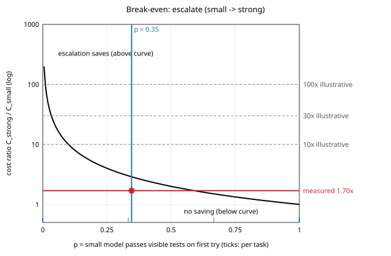

# Escalate or not: small-to-strong model escalation for LLM bug fixing

An independent study on a public benchmark.

A bug-fixing agent can start with a cheap model and call a stronger model only when the
visible tests fail. I wanted to know how much repair quality this keeps compared with always
using the strong model, and what it costs. I ran three policies on 26 QuixBugs Python programs
with two local models (Qwen2.5-Coder 1.5B and 7B). The rules were written down and tagged
before the eval run. Under those rules escalation lost: 79.5% resolved against 85.9% for the
strong model alone, at 56% higher estimated cost. A follow-up analysis, done after seeing the
results, found that most of the quality loss came from the hand-off. When the strong model was
shown the small model's wrong code, it did worse. Passing only the test feedback instead
solved 7 escalated runs that the original hand-off failed, and lost none (7 vs 0, exact sign test p = 0.016, exploratory). With these two
models escalation still cannot save money, because the 7B costs only about 1.7 times as much
per call as the 1.5B.

## Results

Eval split: 26 tasks, 3 repeats per task and policy. Resolution means valid output that passes
all visible and all hidden tests, averaged per task and then over tasks. Costs are list-price
estimates for locally run models, computed from measured tokens.

| Policy | Calls | Resolution | Solved | Est. cost | Cost vs strong_only | Median latency | False acceptance |
|---|---|---|---|---|---|---|---|
| strong_only | 7B, then 7B | 85.9% | 67/78 | $0.0085 | reference | 3.7 s | 4% |
| escalate | 1.5B, then 7B | 79.5% | 62/78 | $0.0132 | +56% | 6.3 s | 3% |
| small_only | 1.5B, then 1.5B | 34.6% | 27/78 | $0.0088 | +4% | 4.0 s | 7% |
| escalate_clean (exploratory) | 1.5B, then 7B with test feedback only | 88.5% | 69/78 | $0.0104 | +22% | invalid | 3% |

The first three rows are the pre-registered eval (`results/eval_local_v1`). escalate_clean was
designed after seeing those results, so it is exploratory (`results/escalate_clean_v1`). Its
latency is not reported because another application was using the GPU during that run.

Pre-set decision rule: escalate is acceptable if it loses at most one task (3.8 percentage
points) against strong_only and costs less. It failed both conditions.

Other findings:

- The 7B never copied the small model's code (0 of 51 escalated runs). It made different
  mistakes. On `subsequences` it made the correct one-line fix and then also changed a loop
  bound, which broke the program.
- strong_only was not winning by having two tries. 66 of its 67 solved runs were solved on the
  first call.
- The 1.5B model often returned the buggy program unchanged.
- On `find_in_sorted` the small model's fix passed every visible test and failed a hidden one.
  Routing on visible tests cannot catch this.
- Per-family results (5 bug families, 3 to 7 tasks each) are in the summary files. They are
  descriptive only.

### Break-even

Escalation saves money only if `p * C_strong > C_small`, where `p` is the share of runs in which
the small model passes the visible tests on its first try. In the eval, p = 0.35, so the strong
model would need to cost more than 2.9 times as much per call. The measured ratio was 1.7. The
dashed lines show illustrative 10x, 30x and 100x price ratios, which is closer to the situation
with a frontier API model behind a small one.



## Method

- Tasks: the 31 QuixBugs Python programs that have JSON test cases. Each has one real bug.
  5 are dev tasks used for tuning (one per bug family) and 26 are eval tasks. The split is
  stratified by bug family with seed 2026.
- Tests: up to 3 visible cases are shown to the model, and at least one of them fails on the
  buggy program. The remaining hidden cases are used only for grading.
- Loop: at most two model calls per run. The first call gets the buggy program and the visible
  tests. If the candidate passes the visible tests, the run stops. Otherwise the second call
  also gets the previous candidate and the visible-test failures. Hidden results never reach a
  prompt or a routing decision.
- Output: the model returns the whole corrected file, not a diff. Small models produce malformed
  diffs too often, and that would measure formatting skill instead of repair skill.
- Sampling: temperature 0.2, seed = 2026 + repeat index, the same seed for every policy within
  a repeat.
- Cost: Fireworks serverless size-tier list prices, $0.10 per 1M tokens for the 1.5B model and
  $0.20 for the 7B (source and date in the config files).
- Full protocol, written before the eval: [docs/experiment_protocol.md](docs/experiment_protocol.md).
  Post-hoc analysis: [docs/exploratory.md](docs/exploratory.md).
- History was rewritten once before publishing to remove a private planning file; commit order
  and dates are unchanged.

## Reproduce

Requires Python 3.10 or newer. The fake run and the tests need no model and no GPU.

```bash
python -m venv .venv
source .venv/bin/activate          # Windows: .venv\Scripts\Activate.ps1
pip install -e ".[dev]"
python -m pytest -q                # tests of the evaluator itself, about 2 minutes
python -m routing_pilot.cli run --config configs/dev_fake.yaml
```

The fake run uses a model that always echoes the bug and one that always returns the
reference fix. Expected: small_only 0%, strong_only 100% with 1 call, escalate 100% with
2 calls.

For the real models, install [Ollama](https://ollama.com/download), then:

```bash
ollama pull qwen2.5-coder:1.5b
ollama pull qwen2.5-coder:7b
python -m routing_pilot.cli check --config configs/dev_local.yaml   # both models should answer
python -m routing_pilot.cli run   --config configs/eval_local.yaml  # 234 runs, about 20 minutes
python -m routing_pilot.cli analyse --campaign eval_local_v1        # rebuild summary.md from logs
python scripts/exploratory.py eval_local_v1 escalate_clean_v1       # exploratory comparison
```

The 7B model (about 4.7 GB) fits in 8 GB of VRAM. I ran everything on a laptop RTX 4070. A run
that is interrupted resumes where it stopped and never repeats a finished run. To rerun a
campaign from scratch, change its `campaign` name. `configs/eval_3tier.TEMPLATE.yaml` adds a
frontier API model. Its key is read from the `FRONTIER_API_KEY` environment variable and never
from a file.

## Layout

```
configs/                campaign configs (models, prices, policies, seeds)
data/public/<task>/     buggy.py, visible cases, labels: the only data a prompt can use
data/private/<task>/    reference fix and hidden cases: grading only
scripts/                prepare_tasks.py (rebuild data/ from QuixBugs), exploratory.py
src/routing_pilot/      repair loop, sandbox, model clients, analysis, CLI
tests/test_infra.py     tests of the evaluator (no leakage, overfit patches caught, resume)
results/<campaign>/     raw JSONL logs, config used, summary.md, per_task.csv
```

## Limitations

- QuixBugs is old and public, so it is probably in the models' training data.
- 26 small single-function programs. This says nothing about multi-file or real-repository work.
- The repeats are correlated. At temperature 0.2 the small model gave only 2 distinct answers
  in 6 seeds on the two tasks I checked.
- The local models are Q4_K_M quantized, while the list prices are for hosted models that are
  usually full precision.
- Costs are estimates. Hardware and energy are not included.
- Some tasks have only one visible test (for example `wrap`), which limits the feedback.
- Model code runs in a separate process with an import and call deny-list. That is isolation,
  not a security sandbox.
- The escalate_clean result is post-hoc. It needs a pre-registered replication before it can be
  claimed.

## Attribution

Tasks are derived from QuixBugs (Lin, Koppel, Chen, Solar-Lezama, 2017),
https://github.com/jkoppel/QuixBugs, MIT licence, see `data/QUIXBUGS_LICENSE`.

Bug-type labels come from Ye, Martinez, Durieux, Monperrus, "A Comprehensive Study of Automatic
Program Repair on the QuixBugs Benchmark", Journal of Systems and Software (2021),
arXiv:1805.03454, Table 1. 22 labels are used as-is and 9 are adapted to the Python diff. The
mapping and the reason for each change are in `scripts/prepare_tasks.py`.

## License

MIT, see `LICENSE`.
